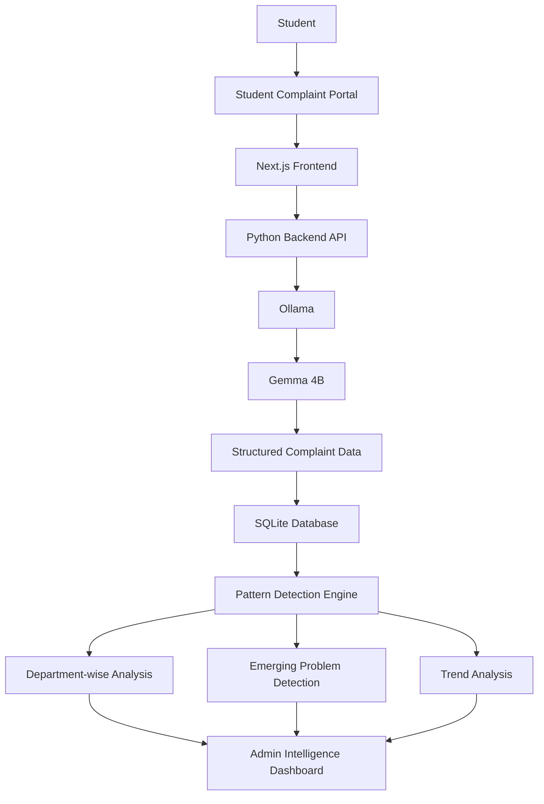

#  PROBLEM PATTERN DETECTOR 

> [The idea is to build an AI-powered system for colleges where students can report problems through a simple terminal, and the college gets an intelligent dashboard that automatically discovers emerging problems from all those reports.]

## Team VANTAGE

**Team Name:** VANTAGE


| Member | Contribution   |
| ------ | -------------- |
| Prithivram | GITHUB REPO |
| Darshan B | FRONT END DEVELOPMENT |
| Badma sree vignesh  | BACKEND DEVELOPMENT |
| Dinesh raj R | PATTERN DETECTION AI TRAINING |


## Problem Statement

### The Problem

College students face a wide range of day-to-day problems, including infrastructure
issues, overcrowded facilities, transport difficulties, maintenance problems,
academic bottlenecks, and other recurring campus concerns. Most colleges already
have ways for students to report these problems, but the reports are usually
treated as individual complaints.

This creates a larger problem: the important information hidden across many
individual reports is difficult to identify manually. Ten students reporting
different symptoms may actually be describing the same underlying issue, while a
new problem may gradually grow across the campus without being recognized early.

As the number of students and reports increases, manually identifying recurring
patterns, detecting emerging issues, understanding their severity, and deciding
which problems need attention becomes increasingly difficult.

### Why We Chose This Problem

We chose this problem because student experiences contain valuable information
about what is actually happening on a campus, yet those experiences often remain
fragmented across individual complaints and reports.

We believe the challenge is not simply collecting more complaints, but making
sense of the information that already exists. An intelligent system should be
able to look across reports, recognize connections between seemingly different
complaints, identify recurring and emerging problems, and help administrators
understand what requires attention.

Our goal is to bridge the gap between **individual student experiences and
campus-level decision making**.

## Solution

**Problem Pattern Detector** is an AI-powered system designed to discover
meaningful patterns from student problem reports.

Students can submit problems through a simple reporting interface using natural
language. Instead of treating each report independently, the system analyzes
reports collectively to identify related complaints, recurring issues, emerging
patterns, and potential areas of concern.

These insights are presented through an intelligent dashboard for college
administrators, helping them understand **what problems are occurring, where
they are occurring, how frequently they are being reported, and which issues
appear to be emerging or becoming more significant**.

The goal is to transform scattered student reports into a clearer,
data-driven view of campus problems and enable earlier, more informed action.
## Key Features

- **Natural-language problem reporting** — Students simply describe their problem instead of navigating complex forms.
- **AI-powered complaint understanding** — Gemma 4B analyzes each report and extracts department, issue, location, time, severity, summary, and key themes.
- **Department-wise intelligence dashboard** — Reports are automatically organized into areas such as Food, Hostel, Transport, Wi-Fi, Academics, Infrastructure, and Cleanliness.
- **Emerging problem detection** — The system groups related reports and identifies recurring or rapidly increasing problem patterns.
- **Evidence-based problem insights** — Administrators can view report counts, trends, common themes, and representative student reports behind a detected problem.
- **Local AI processing** — Gemma runs through Ollama locally, reducing the need to send sensitive student feedback to external AI services.


## Innovation and Differentiation

Unlike conventional complaint systems that simply collect and display individual
student reports, **Problem Pattern Detector** uses AI to understand and
standardize naturally written complaints into structured problem information.

The system then analyzes these reports collectively to identify related issues,
recurring patterns, and emerging problems across departments and locations.
This shifts the workflow from **individual complaint tracking to automated
campus-level problem intelligence**, helping administrators identify significant
issues earlier and prioritize them based on evidence and trends.
### Architecture

## Technical Implementation

### Architecture

## Technical Implementation

### Architecture


| Category        | Technologies                |
| --------------- | --------------------------- |
| Frontend        | [Technologies / N/A]        |
| Backend         | [Technologies / N/A]        |
| Database        | [Technologies / N/A]        |
| AI / ML         | [Models / frameworks / N/A] |
| Infrastructure  | [Technologies / N/A]        |
| APIs / Services | [Services / N/A]            |


If a category or technology is not implemented in the project, specify `N/A` instead of leaving the field blank.

### How It Works

[Explain the major components of the system and how they interact.]

### Technical Decisions

[Explain important architectural, algorithmic, or engineering decisions made during development.]

## Implementation During the Hackathon

[Describe what the team built during the Hack Day and the major functionality or components completed during the event.]

### Team Contributions

- **[Member Name]:** [Contribution]
- **[Member Name]:** [Contribution]
- **[Member Name]:** [Contribution]
- **[Member Name]:** [Contribution]

## Working Application

**Live Application:** [Live URL]

[Briefly explain how the deployed application can be accessed and what functionality can be tested.]

The submitted application should be functional and accessible through the provided link where applicable.

## Demo Video

**Demo Video:** [Video URL]

[Provide a short demonstration of the working project, covering the main user flow and important functionality.]

## Open Source and AI Usage

### AI / Models

- **[Model]:** [How it is used]

### Open Source Components

- **[Library / Framework]:** [Purpose]
- **[Dataset]:** [Purpose]
- **[API / Service]:** [Purpose]

[Include relevant licenses, attribution, and acknowledgements for external components.]

## Setup and Usage

### Prerequisites

- [Requirement]
- [Requirement]

### Installation

```bash
git clone [repository-url]
cd [project-directory]
[installation-command]
```

### Environment Variables

```env
[VARIABLE_NAME]=[value]
```


### Running the Project

```bash
[run-command]
```

### Usage

[Explain the basic steps required to use the project.]

## Devpost Submission

**Devpost Project:** [Devpost Project URL]

[Add the link to the team's Devpost submission. Ensure the Devpost project page is complete and contains the required project information, links, media, and team details.]

## Credits and License

### Credits

[Credit libraries, frameworks, datasets, models, APIs, contributors, and other external resources used.]

### License

[License name and/or link.]

## Submission Checklist

- [ ] Project title and description added
- [ ] All team members listed
- [ ] Problem clearly explained
- [ ] Reason for choosing the problem explained
- [ ] Solution and key features documented
- [ ] Innovation and differentiation explained
- [ ] Architecture included
- [ ] Technical implementation documented
- [ ] Work completed during the hackathon documented
- [ ] Team contributions documented
- [ ] Working application is functional
- [ ] Live application link added where applicable
- [ ] Demo video added
- [ ] AI and open-source components documented
- [ ] Setup and usage instructions tested
- [ ] Challenges and learnings documented
- [ ] Devpost submission completed
- [ ] Devpost link added
- [ ] Credits added
- [ ] License added
- [ ] Repository is organized and complete
