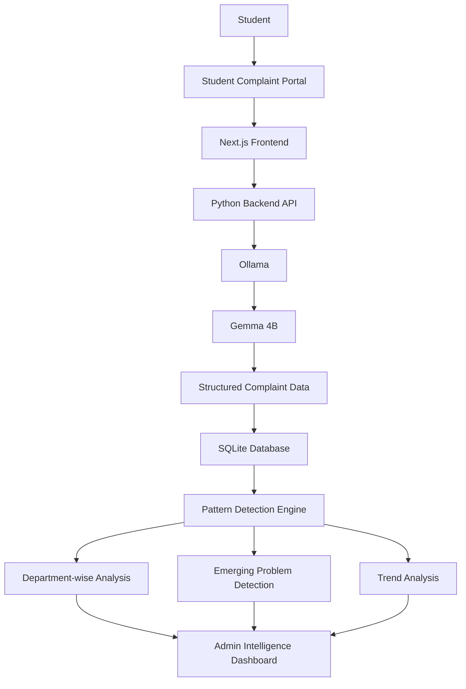

#  PROBLEM PATTERN DETECTOR 

> [The idea is to build an AI-powered system for colleges where students can report problems through a simple terminal, and the college gets an intelligent dashboard that automatically discovers emerging problems from all those reports.]

## Team VANTAGE

**Team Name:** VANTAGE


| Member | Contribution |
| ------ | ------------ |
| Prithivram | GitHub Repository & Project Integration |
| Darshan B | Frontend Development & UI Implementation |
| Badma Sree Vignesh | Backend Development, API & Database Integration |
| Dinesh Raj R | AI Prompt Design & Pattern Detection Development |


## Problem Statement

### The Problem

College students face a wide range of day-to-day problems, including infrastructure
issues, overcrowded facilities, transport difficulties, maintenance problems,
academic bottlenecks, and other recurring campus concerns. Most colleges already
have ways for students to report these problems, but the reports are usually
treated as individual complaints.

This creates a larger problem: the important information hidden across many
individual reports is difficult to identify manually. Ten students reporting
different symptoms may actually be describing the same underlying issue, while a
new problem may gradually grow across the campus without being recognized early.

As the number of students and reports increases, manually identifying recurring
patterns, detecting emerging issues, understanding their severity, and deciding
which problems need attention becomes increasingly difficult.

### Why We Chose This Problem

We chose this problem because student experiences contain valuable information
about what is actually happening on a campus, yet those experiences often remain
fragmented across individual complaints and reports.

We believe the challenge is not simply collecting more complaints, but making
sense of the information that already exists. An intelligent system should be
able to look across reports, recognize connections between seemingly different
complaints, identify recurring and emerging problems, and help administrators
understand what requires attention.

Our goal is to bridge the gap between **individual student experiences and
campus-level decision making**.

## Solution

**Problem Pattern Detector** is an AI-powered system designed to discover
meaningful patterns from student problem reports.

Students can submit problems through a simple reporting interface using natural
language. Instead of treating each report independently, the system analyzes
reports collectively to identify related complaints, recurring issues, emerging
patterns, and potential areas of concern.

These insights are presented through an intelligent dashboard for college
administrators, helping them understand **what problems are occurring, where
they are occurring, how frequently they are being reported, and which issues
appear to be emerging or becoming more significant**.

The goal is to transform scattered student reports into a clearer,
data-driven view of campus problems and enable earlier, more informed action.
## Key Features

- **Natural-language problem reporting** — Students simply describe their problem instead of navigating complex forms.
- **AI-powered complaint understanding** — Gemma 4B analyzes each report and extracts department, issue, location, time, severity, summary, and key themes.
- **Department-wise intelligence dashboard** — Reports are automatically organized into areas such as Food, Hostel, Transport, Wi-Fi, Academics, Infrastructure, and Cleanliness.
- **Emerging problem detection** — The system groups related reports and identifies recurring or rapidly increasing problem patterns.
- **Evidence-based problem insights** — Administrators can view report counts, trends, common themes, and representative student reports behind a detected problem.
- **Local AI processing** — Gemma runs through Ollama locally, reducing the need to send sensitive student feedback to external AI services.


## Innovation and Differentiation

Unlike conventional complaint systems that simply collect and display individual
student reports, **Problem Pattern Detector** uses AI to understand and
standardize naturally written complaints into structured problem information.

The system then analyzes these reports collectively to identify related issues,
recurring patterns, and emerging problems across departments and locations.
This shifts the workflow from **individual complaint tracking to automated
campus-level problem intelligence**, helping administrators identify significant
issues earlier and prioritize them based on evidence and trends.
### Architecture

## Technical Implementation

### Architecture


### Technology Stack

| Category        | Technologies |
| --------------- | ------------ |
| Frontend        | Next.js, React, TypeScript, Tailwind CSS |
| Backend         | Python, FastAPI |
| Database        | SQLite |
| AI / ML         | Gemma 4B, Ollama |
| Infrastructure  | Local development environment |
| APIs / Services | Ollama Local API |

### How It Works

Students submit campus problems in natural language through the web interface.
The Python backend sends each report to Gemma 4B through the local Ollama API,
which extracts structured information such as department, issue, location,
severity, time, summary, and key themes.

The structured reports are stored in SQLite and analyzed by the pattern detection
layer to group related issues, measure report frequency, and identify recurring
or emerging problem trends. The administrator dashboard then presents these
insights department-wise along with supporting reports, severity, and trend data.

### Technical Decisions

Gemma is used specifically for natural-language understanding and structured
information extraction, while deterministic backend logic handles aggregation,
grouping, counting, and trend calculations. This separation improves
predictability and makes the pattern detection process easier to validate.

Ollama is used to run Gemma locally, avoiding dependency on external AI APIs and
allowing student reports to be processed within the local environment. SQLite
was selected for lightweight, reliable storage suitable for the hackathon
prototype.

## Implementation During the Hackathon

During the Hack Day, we developed a working prototype of the Problem Pattern
Detector with a student-facing reporting interface and an administrator
intelligence dashboard.

The implemented workflow covers natural-language problem submission, AI-based
complaint classification using Gemma 4B and Ollama, structured data storage,
department-wise organization, recurring and emerging pattern detection, trend
analysis, and visualization of problem insights for administrators.
### Team Contributions

- **Prithivram:** GitHub repository management and project integration
- **Darshan B:** Frontend development and UI implementation
- **Badma Sree Vignesh:** Backend development, API and database integration
- **Dinesh Raj R:** AI prompt design and pattern detection development

## Working Application

**Live Application:** N/A — The prototype is currently designed to run locally.

The application can be run locally with the Next.js frontend, Python FastAPI backend, SQLite database, and Ollama with Gemma 4B. Users can submit campus complaints through the student portal, while administrators can view structured reports, emerging problems, trends, and department-wise insights through the dashboard.

## Demo Video

**Demo Video:** [YouTube Video URL]

The demo demonstrates the complete workflow of Problem Pattern Detector, including natural-language complaint submission, AI-based complaint understanding using Gemma 4B, structured complaint storage, pattern detection, and visualization through the admin intelligence dashboard.

## Open Source and AI Usage

### AI / Models

- **Gemma 4B:** Used for understanding natural-language student complaints and extracting structured information such as department, issue, location, time, severity, short summary, and key themes.
- **Ollama:** Used as the local runtime for running the Gemma 4B model.

### Open Source Components

- **Next.js / React:** Frontend application and user interface.
- **FastAPI:** Python backend API and communication layer.
- **SQLite:** Lightweight database for storing structured complaint data.
- **Ollama:** Local AI model runtime.
- **Python:** Backend processing, aggregation, grouping, pattern detection, and trend analysis.
- **Dataset:** N/A — The prototype does not use a separate external dataset.

## Setup and Usage

### Prerequisites

- Node.js and npm
- Python 3.x
- Ollama
- Gemma 4B model

### Installation

```bash
git clone [repository-url]
cd [project-directory]

npm install

cd backend
pip install -r requirements.txt
